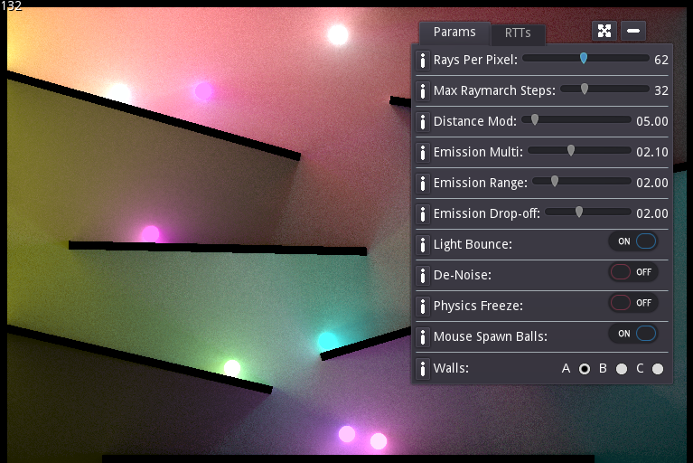

# Godot 2D Global Illumination Demo

This is a demo of 2D global illumination implemented in the Godot game engine. I made it because I didn't find any examples of this sort of 2D rendering in Godot, and no examples in other engines that had publicly available code.

I make no claim that all the code here is written from scratch by me, or that I came up with the algorithms used. I referenced a lot of Shadertoy projects when writing the global illumination and Jump Flood algorithms (to create the Voronoi diagram), and initial ideas and concepts were drawn from work other people had shared on Reddit and other game development communities.

## Using this in your game

Feel free to re-use as much code from here as you want (as per the MIT license) in your own projects.

However, at this stage, to make use of this in an actual game will require a deep understanding of the algorithms involved and lots of tweaking and fiddling to make things work. I do plan to continue developing this to make it as plug-and-play as possible, but for now it serves as more of a demo and reference for those looking to implement this sort of rendering technology in their game.

## References

The primary references used when creating this demo were:

* [Fast Voronoi Diagrams and Distance Field Textures...](https://blog.demofox.org/2016/02/29/fast-voronoi-diagrams-and-distance-dield-textures-on-the-gpu-with-the-jump-flooding-algorithm/)
* [Shadertoy - Jump Flood Algorithm](https://www.shadertoy.com/view/Mdy3DK)
* [Shadertoy - 2D GI](https://www.shadertoy.com/view/lltcRN)
* [/u/LexieD Reddit post](https://www.reddit.com/r/Unity3D/comments/8nbvph/wip_custom_realtime_2d_gi_in_unity3d/?st=jhtqlpti&sh=0a3bc7e8)
* [/u/toocanzs Reddit post](https://www.reddit.com/r/gamedev/comments/91mwrh/infinity_2d_lights_with_shadows_gi/)

## Next steps

As mentioned, I do plan to continue working on this and creating documentation for it. Here's a rough list of things I want to improve on:

* Easier integration into existing Godot projects (think of the probe system for 3D GI in Godot).
* Arbitrary GI buffer size for integration into projects where calculating individual lighting data for 1920x1080 pixels would be prohibitively expensive.
* Blur filter to reduce noise.
* General optimisations (some passes and colour/emission buffers could probably be combined, branching in shaders reduced, etc).